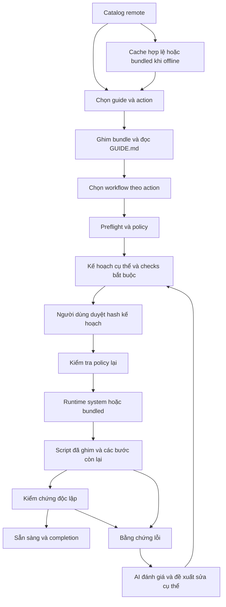

# Kiến trúc EasyAI 0.4

## Phạm vi

Giữ ứng dụng Electron/TypeScript hiện tại, tách logic thành các phần dễ đọc và có hợp đồng rõ ràng. Giai đoạn này không viết lại EasyAI bằng Go. Dữ liệu hướng dẫn, workflow và kết quả thực thi có thể dùng lại khi triển khai một agent bằng ngôn ngữ khác.

## Các lớp

| Lớp | Mã chính | Trách nhiệm |
|---|---|---|
| Domain | `src/domain/guide.ts`, `policy.ts`, `digest.ts`; hợp đồng `src/shared/guide.ts`, `runtime.ts` | Metadata, action, tài nguyên, chọn workflow, predicate, SHA256 và policy. Không truy cập Electron, mạng, registry hoặc AI. SHA256 dùng thư viện chuẩn Node và có ánh xạ trực tiếp sang thư viện chuẩn ngôn ngữ khác. |
| Application | `src/application/guide-engine.ts`, `workflow.ts`, `hooks.ts`, `tool-contract.ts`, `ports.ts` | Phiên làm việc, đọc guide, preflight, duyệt kế hoạch, thực thi, kiểm chứng, chẩn đoán, giới hạn sửa lỗi, hook, hội thoại và trace. |
| Adapter | `src/main/guides.ts`, `executor.ts`, `runtime-bundles.ts`, `guide-scripts.ts`, `guide-runtime.ts`, `guide-store.ts`, `trace.ts`, `codex-provider.ts`; `src/agent/` | GitHub/cache, filesystem, Windows, PowerShell, runtime, SQLite, Pi worker và credentials. |
| Presentation | `src/renderer/`, `src/preload/`, `src/main/guide-main.ts` | Catalog, tag, chọn tác vụ, chat, hiển thị kế hoạch/bằng chứng và IPC. `guide-main` là composition root. |
| Content | `content/guides/`, kho `easy-ai-docs` | Hướng dẫn, workflow, script, template, references và attachments. |

`src/main/guide-engine.ts` và `hooks.ts` chỉ còn re-export để giữ tương thích import hiện có. Core application không import adapter main. Các kiểu ở shared phục vụ cả IPC và engine; chưa chuyển tên file đồng loạt để tránh thay đổi không cần thiết.

Các port chính là `GuideRepository`, `RunStore`, `ToolExecutor`, `GuideRuntime`, `TraceSink`. Tool executor nhận mutation và bundle của phiên; AI không có quyền tự truy cập filesystem hoặc credential store. Codex provider là capability của adapter để khóa không phải đi qua script/tài liệu/hội thoại. Đây là điểm riêng của bản tích hợp Codex, không phải nhánh chọn guide trong engine.

## Luồng thực thi

`prepare_workflow` dùng đúng `workflows[action]`; guide cũ không khai báo map được đọc `workflow.json`. Cùng một hàm chọn workflow được dùng khi chuẩn bị, giữ checks bắt buộc và hiển thị completion, tránh cài nhầm trong tác vụ doctor. Workflow có thể có `steps: []` để chỉ chẩn đoán. PowerShell chẩn đoán vẫn được đưa vào kế hoạch cụ thể trước khi chạy.

`execute_plan` chạy tuần tự trong phạm vi đã duyệt, lưu bước hoàn tất. Khi sửa kế hoạch, chỉ giữ lại các bước installer đã hoàn tất có nội dung không đổi; cấu hình và checks được thực hiện lại khi cần. Script thất bại dừng chuỗi; kết quả mô tả của AI không thể đánh dấu ready. Engine giới hạn số vòng sửa lỗi; đăng nhập/MFA được yêu cầu bằng user confirmation và kiểm chứng phụ thuộc `afterConfirmation`.

## Tài nguyên và nguồn

Catalog v3: `content/guides-catalog.json`, ghim commit SHA 40 ký tự và SHA256 từng tài nguyên. Client vẫn đọc được catalog v2 để tương thích cache và fixture cũ. Không thay pointer v1/v2 đã phát hành. Mỗi lần catalog/load đều kiểm tra pointer remote; nội dung cùng revision được tái sử dụng sau khi kiểm hash. Tải tài nguyên tối đa 6 kết nối đồng thời, gộp refresh đồng thời để tránh ghi cache chồng nhau.

Folder không có GUIDE.md được bỏ qua. Metadata hoặc workflow không hợp lệ làm bundle bị từ chối. File bên ngoài folder, symlink, đường dẫn vượt thư mục, tên trùng không phân biệt hoa thường và hash sai đều bị chặn. Giới hạn: 100 guide/catalog, 100 file/guide, 1 MiB/file, 20 MiB/catalog. Artifact runtime lớn đi qua manifest/release riêng. Attachment nhị phân được giữ bằng base64 trong persisted bundle với encoding rõ ràng; hash tính trên byte gốc. AI chỉ đọc văn bản qua `guide_read`.

Sau khi duyệt, adapter tạo một folder riêng dưới `workspace/.guide-runs`, khôi phục file/text/binary và chạy đường dẫn script bằng lệnh ngắn. `$PSScriptRoot` trỏ đúng folder scripts; tài nguyên kế bên có thể được đọc bằng đường dẫn tương đối. Script PowerShell được thêm UTF-8 BOM khi materialize để Windows PowerShell 5.1 đọc đúng tiếng Việt. Các folder này được giữ để chẩn đoán; hiện chưa có cơ chế dọn tự động cho tài nguyên phiên.

## Runtime

`ensure_runtime` khai báo `runtime` và `minVersion`. Resolver kiểm tra executable có sẵn (Node kèm npm), rồi cache đã xác minh, cuối cùng tải artifact từ release `easy-ai-docs`. Không phụ thuộc Git/Node để tải Git/Node: adapter dùng HTTP và ZIP của Windows. Manifest có phiên bản, platform, executable, thư mục PATH, URL gốc/license, kích thước và SHA256. ZIP được kiểm tra đường dẫn trước giải nén, sau đó kiểm tra hash file, executable version và publish folder bằng rename.

PATH chỉ áp dụng tiến trình, được khôi phục từ cache khi mở lại EasyAI; launcher do guide tạo giữ các đường dẫn runtime cần thiết. Không cấp quyền admin, không sửa registry/PATH toàn máy. Nguồn GitHub và các release là trust root của hệ thống hiện tại; checksum bảo vệ tính toàn vẹn, không phải chữ ký tác giả độc lập.

## Hợp đồng dành cho giai đoạn chuyển đổi

`npm run docs:schemas` xuất JSON Schema trong `contracts/`. GUIDE metadata phiên bản 1, workflow phiên bản 1, runtime manifest phiên bản 1; catalog mới phiên bản 3; dữ liệu phiên vẫn schemaVersion 2. Các ràng buộc liên trường (tham chiếu script/check, đường dẫn, hash, policy) được kiểm trong domain/application ngoài JSON Schema.

Một implementation tương lai cần giữ các điều kiện: đọc GUIDE trước tool; ghim bundle; chọn action nhất quán; hash kế hoạch; recheck policy; không bỏ checks bắt buộc; lưu completed steps/evidence; tách manual login; propagation hủy; kiểm chứng trước ready; redaction và trace. Các regression test có thể chuyển thành fixture kiểm thử chung. Windows script vẫn là tài nguyên phụ thuộc platform; thay engine bằng Go không tự biến chúng thành script đa nền tảng.

Điểm còn giữ từ hệ thống hiện tại: model/provider nội bộ trong config, Windows x64, adapter bảo vệ key qua DPAPI, SQLite schema cũ và Pi worker. Việc thay các thành phần này cần adapter tương ứng, không yêu cầu viết lại format GUIDE.
